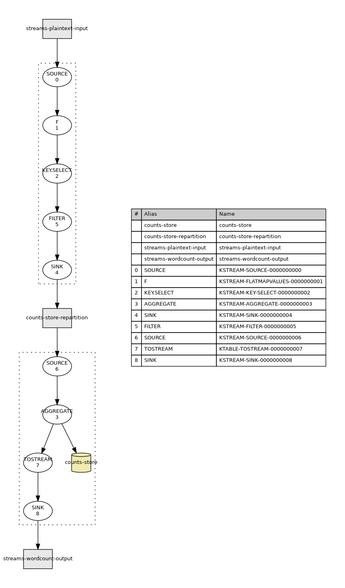

# KProjekt - Kafka Topology Visualization


Visualizes kafka topology.


<br clear="right" /><!-- Turn off the wrapping for the logo image. -->

## Usage

- Install [Graph Visualization Tools](https://graphviz.gitlab.io/).
  ```bash
  # Ubuntu
  sudo apt install graphviz
  ```
- Download and extract [kproject-cli executable](https://github.com/gchudnov/kprojekt/releases).
- Prepare a file with Kafka-topology ([word-count example](res/example/word-count.log)).
- Run application from the command line:

  ```bash
  ./kprojekt-cli ./word-count.log
  ```

- An output png-image with the same name as the topology file will be created: `word-count.png`.



## Command-line parameters

```text
  ./kprojekt-cli --help

  kprojekt-cli 1.3.1
  Usage: kprojekt-cli [options] <file>

  --help           prints this usage text
  --verbose        verbose mode
  --space <value>  space between nodes: [small,s; medium,m; large,l] (default: m)
  <file>           path to topology description
  --version
```

## Contact

[Grigorii Chudnov](mailto:g.chudnov@gmail.com)

## License

Distributed under the [The MIT License (MIT)](LICENSE).
