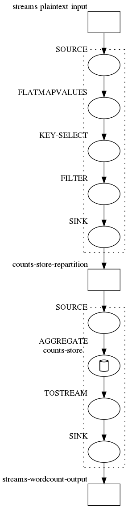

# [WIP] KProjekt -- Kafka Topology Visualization

[](https://travis-ci.org//gchudnov/kprojekt)

Represents Kafka topology as an image.

## Example

Code

```scala
val builder = new StreamsBuilder
val source = builder.stream[String, String]("streams-plaintext-input")
source
  .flatMapValues(value => value.toLowerCase.split("\\W+").toList.asJava)
  .groupBy((key, value) => value)
  .count(Materialized.as[String, java.lang.Long, KeyValueStore[Bytes, Array[Byte]]]("counts-store"))
  .toStream()
  .to("streams-wordcount-output")

val topology = builder.build()
val desc = topology.describe()
```

Topology

```text
Topologies:
   Sub-topology: 0
    Source: KSTREAM-SOURCE-0000000000 (topics: [streams-plaintext-input])
      --> KSTREAM-FLATMAPVALUES-0000000001
    Processor: KSTREAM-FLATMAPVALUES-0000000001 (stores: [])
      --> KSTREAM-KEY-SELECT-0000000002
      <-- KSTREAM-SOURCE-0000000000
    Processor: KSTREAM-KEY-SELECT-0000000002 (stores: [])
      --> KSTREAM-FILTER-0000000005
      <-- KSTREAM-FLATMAPVALUES-0000000001
    Processor: KSTREAM-FILTER-0000000005 (stores: [])
      --> KSTREAM-SINK-0000000004
      <-- KSTREAM-KEY-SELECT-0000000002
    Sink: KSTREAM-SINK-0000000004 (topic: counts-store-repartition)
      <-- KSTREAM-FILTER-0000000005

  Sub-topology: 1
    Source: KSTREAM-SOURCE-0000000006 (topics: [counts-store-repartition])
      --> KSTREAM-AGGREGATE-0000000003
    Processor: KSTREAM-AGGREGATE-0000000003 (stores: [counts-store])
      --> KTABLE-TOSTREAM-0000000007
      <-- KSTREAM-SOURCE-0000000006
    Processor: KTABLE-TOSTREAM-0000000007 (stores: [])
      --> KSTREAM-SINK-0000000008
      <-- KSTREAM-AGGREGATE-0000000003
    Sink: KSTREAM-SINK-0000000008 (topic: streams-wordcount-output)
      <-- KTABLE-TOSTREAM-0000000007
```

Graph



## Building

To build a fat-jar 

```bash
sbt cli/assembly
```

An executable binary will be built `kprojekt-cli-0.9.0`.

## Contact

[Grigorii Chudnov](mailto:g.chudnov@gmail.com)

## License

Distributed under the [The MIT License (MIT)](https://github.com/gchudnov/w3c-css/blob/master/LICENSE).
